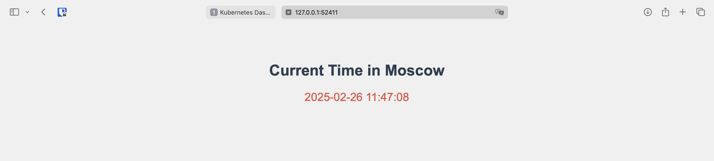
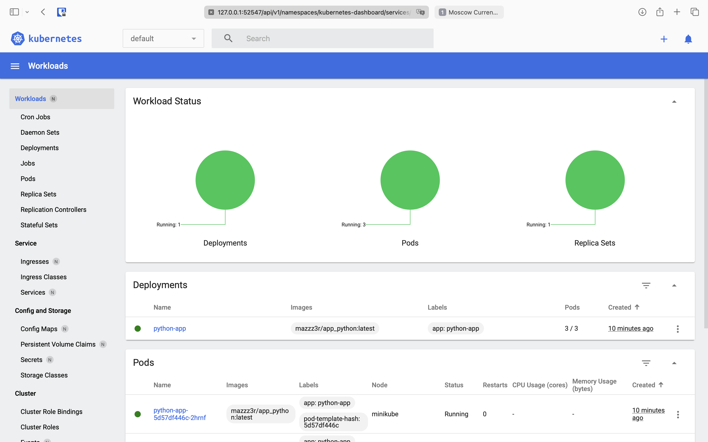

# Kubernetes Deployment Documentation

## Setup

1. Start minikube:
```bash
minikube start
```

2. Apply manifests:
```bash
kubectl apply -f deployment.yml
kubectl apply -f service.yml
```

3. Verify deployment:
```bash
kubectl get pods,svc
```

## Current Status

### Pods and Services
```bash
# Output of kubectl get pods,svc
NAME                              READY   STATUS    RESTARTS   AGE
pod/python-app-5d57df446c-2hrnf   1/1     Running   0          36s
pod/python-app-5d57df446c-gnjvx   1/1     Running   0          36s
pod/python-app-5d57df446c-t7zph   1/1     Running   0          36s

NAME                         TYPE        CLUSTER-IP       EXTERNAL-IP   PORT(S)          AGE
service/kubernetes           ClusterIP   10.96.0.1        <none>        443/TCP          2m27s
service/python-app-service   NodePort    10.101.209.168   <none>        5000:30000/TCP   31s
```

### Minikube Service
```bash
# Output of minikube service --all
|-----------|------------|-------------|--------------|
| NAMESPACE |    NAME    | TARGET PORT |     URL      |
|-----------|------------|-------------|--------------|
| default   | kubernetes |             | No node port |
|-----------|------------|-------------|--------------|
😿  service default/kubernetes has no node port
|-----------|--------------------|-------------|---------------------------|
| NAMESPACE |        NAME        | TARGET PORT |            URL            |
|-----------|--------------------|-------------|---------------------------|
| default   | python-app-service |        5000 | http://192.168.49.2:30000 |
|-----------|--------------------|-------------|---------------------------|
❗  Services [default/kubernetes] have type "ClusterIP" not meant to be exposed, however for local development minikube allows you to access this !
🏃  Starting tunnel for service kubernetes.
🏃  Starting tunnel for service python-app-service.
|-----------|--------------------|-------------|------------------------|
| NAMESPACE |        NAME        | TARGET PORT |          URL           |
|-----------|--------------------|-------------|------------------------|
| default   | kubernetes         |             | http://127.0.0.1:52410 |
| default   | python-app-service |             | http://127.0.0.1:52411 |
|-----------|--------------------|-------------|------------------------|
🎉  Opening service default/kubernetes in default browser...
🎉  Opening service default/python-app-service in default browser...
❗  Because you are using a Docker driver on darwin, the terminal needs to be open to run it.
```

### Application Access



## Cleanup

To remove the deployment and service:
```bash
kubectl delete -f deployment.yml
kubectl delete -f service.yml
```

To stop minikube:
```bash
minikube stop
``` 