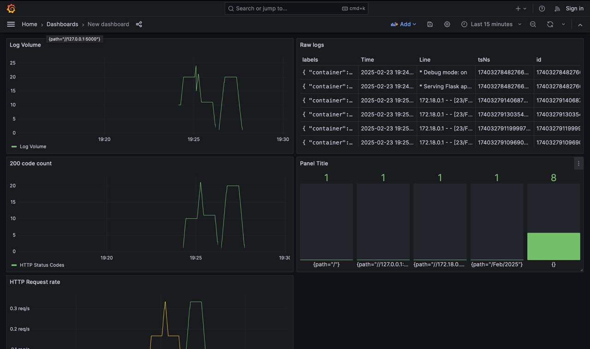

# Logging Stack Documentation

## Overview
This logging stack consists of:
- Loki: Log aggregation system
- Promtail: Log collector
- Grafana: Visualization platform
- Python Application: Source of logs

## Components Setup

### Loki
- Port: 3100
- Storage: Local filesystem
- Configuration: /config/loki-config.yaml
- Purpose: Stores and indexes logs

### Promtail
- Configuration: /config/promtail-config.yaml
- Sources: Docker containers
- Labels: container, stream, ip, method, path, status
- Pipeline stages: regex parsing for HTTP logs

### Grafana
- Port: 3000
- Access: http://localhost:3000
- Dashboards:
  1. HTTP Request Rate
  2. Status Code Distribution
  3. Recent Logs
  4. Request Count by Path
  5. Error Rate

### Python Application
- Port: 5000
- Logging: JSON format via Docker logging driver
- Metrics collected: HTTP requests, status codes, paths

## Monitoring Dashboard

### Main Metrics
1. HTTP Request Rate
   - Query: `sum(rate({container=~".*python_app.*"} |~ "HTTP" [1m])) by (status)`
   - Purpose: Shows request rate over time

2. Status Distribution
   - Query: `sum by (status)(count_over_time({container=~".*python_app.*"} |~ "HTTP" [5m]))`
   - Purpose: Visualizes HTTP status code distribution

3. Error Rate
   - Query: `sum(rate({container=~".*python_app.*"} |~ "HTTP" !~ "200" [5m]))`
   - Purpose: Monitors non-200 responses

## Setup Instructions

1. Start the monitoring stack:
```bash
cd monitoring
docker-compose up -d
```

2. Access Grafana:
   - URL: http://localhost:3000
   - Default access: Anonymous auth enabled

3. Verify logs are flowing:
```bash
curl http://localhost:5000
```

## Screenshots



## Maintenance

### Log Rotation
- JSON file driver configured with:
  - max-size: "10m"
  - max-file: "3"

### Backup
- Grafana dashboards can be exported as JSON
- Loki data persisted in Docker volumes

### Troubleshooting
1. Check container status:
```bash
docker-compose ps
```

2. View service logs:
```bash
docker-compose logs loki
docker-compose logs promtail
```

3. Verify log collection:
```bash
curl -G -s "http://localhost:3100/loki/api/v1/query" --data-urlencode 'query={container=~".*python_app.*"}'
```
