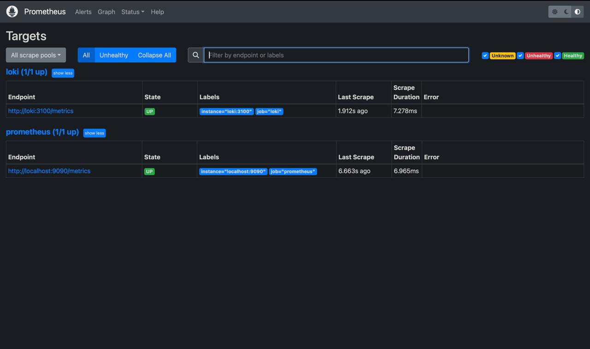
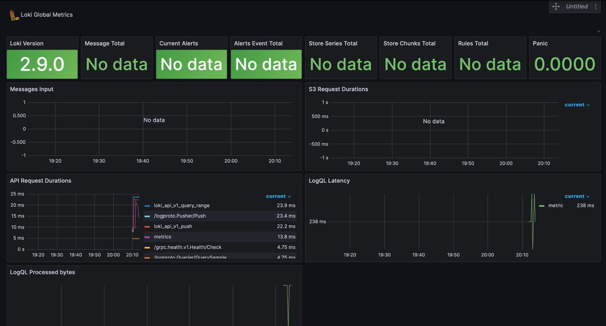
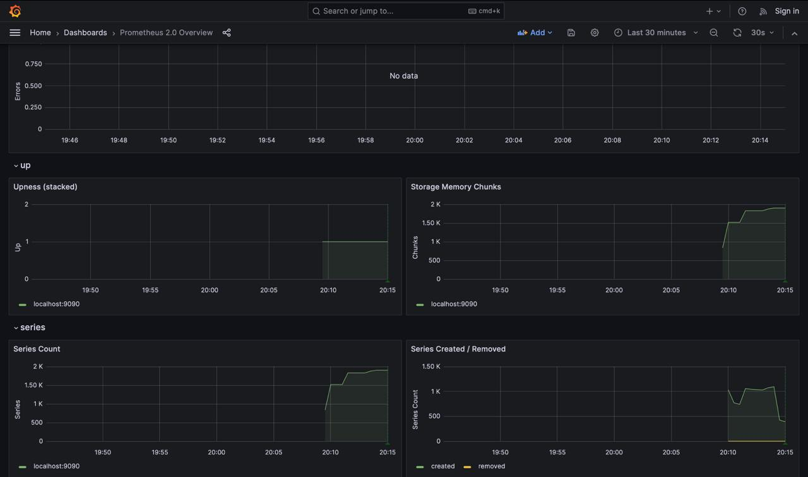
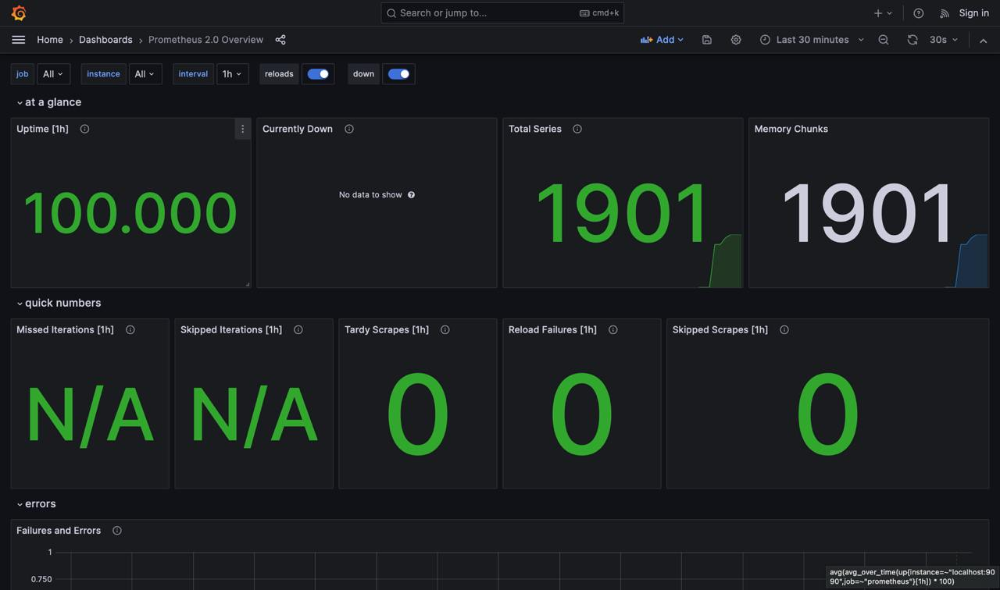

# Metrics Documentation

## Overview
This document outlines the monitoring setup using Prometheus and Grafana, integrated with our existing logging stack.

## Components Setup

### Prometheus
- **Port**: 9090
- **Access URL**: http://localhost:9090
- **Targets**:
  - Prometheus itself (9090)
  - Loki (3100)
  - Python Application (5000)
- **Configuration**: Located in `config/prometheus.yml`
- **Data Persistence**: Using Docker volume `prometheus-data`

### Service Configurations

#### Python Application
- Memory Limits: 512MB
- Log Rotation:
  - Max Size: 10m
  - Max Files: 3
- Metrics Endpoint: `/metrics`
- Collected Metrics:
  - `http_requests_total`
  - `http_errors_total`

#### Loki
- Memory Limits: 1GB
- Storage:
  - Retention: 168h
  - Chunk Period: 5m

#### Prometheus
- Memory Limits: 2GB
- Scrape Interval: 15s
- Evaluation Interval: 15s

## Grafana Dashboards

### 1. Application Metrics
- HTTP Request Rate
- Error Rate
- Response Time Distribution
- Request Count by Path

### 2. System Metrics
- Container Memory Usage
- Container CPU Usage
- Network I/O
- Disk Usage

## Verification Steps

1. Check Prometheus Targets:
```bash
curl http://localhost:9090/api/v1/targets
```

2. Verify Metrics Collection:
```bash
# Application metrics
curl http://localhost:5000/metrics

# Prometheus metrics
curl http://localhost:9090/metrics

# Loki metrics
curl http://localhost:3100/metrics
```

## Service Health Checks

### Python Application
- Endpoint: http://localhost:5000/metrics
- Expected Response: 200 OK
- Metrics Format: Prometheus text format

### Prometheus
- Endpoint: http://localhost:9090/targets
- Status: All targets should be "UP"
- Scrape Interval: 15s

### Loki
- Endpoint: http://localhost:3100/ready
- Expected Response: "ready"

## Screenshots

### 1. Prometheus Targets


### 2. Grafana Dashboards




## Maintenance

### Log Rotation
All services are configured with log rotation:
```yaml
logging:
  driver: "json-file"
  options:
    max-size: "10m"
    max-file: "3"
```

### Memory Limits
Services are configured with appropriate memory limits to prevent resource exhaustion:
```yaml
deploy:
  resources:
    limits:
      memory: 512M
```

### Data Retention
- Prometheus: 15 days default retention
- Loki: 7 days log retention

## Troubleshooting

1. Check Service Status:
```bash
docker-compose ps
```

2. View Service Logs:
```bash
docker-compose logs prometheus
docker-compose logs loki
```

3. Verify Metrics:
```bash
# Generate test traffic
for i in {1..10}; do curl http://localhost:5000; sleep 1; done

# Check metrics in Prometheus
curl http://localhost:9090/api/v1/query?query=http_requests_total
``` 